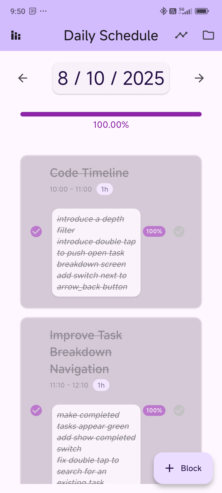
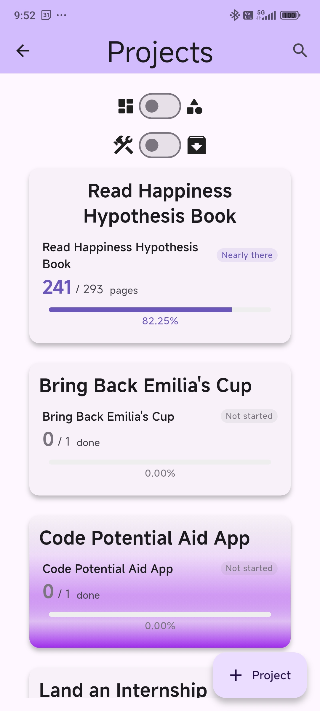
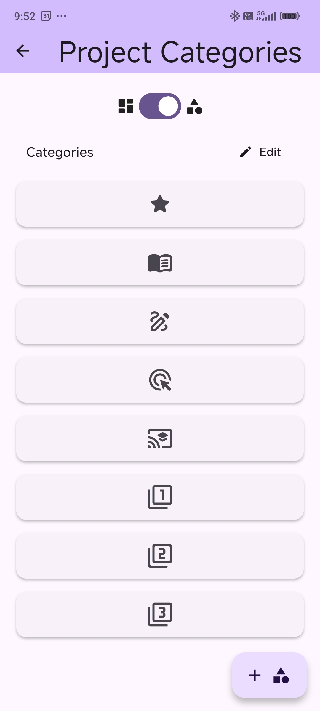
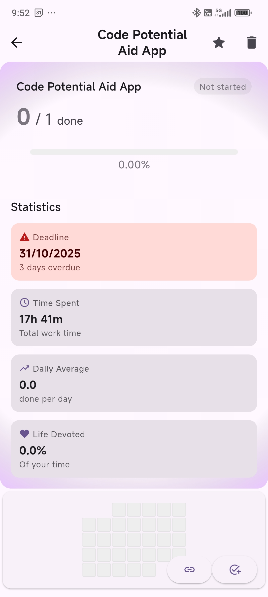
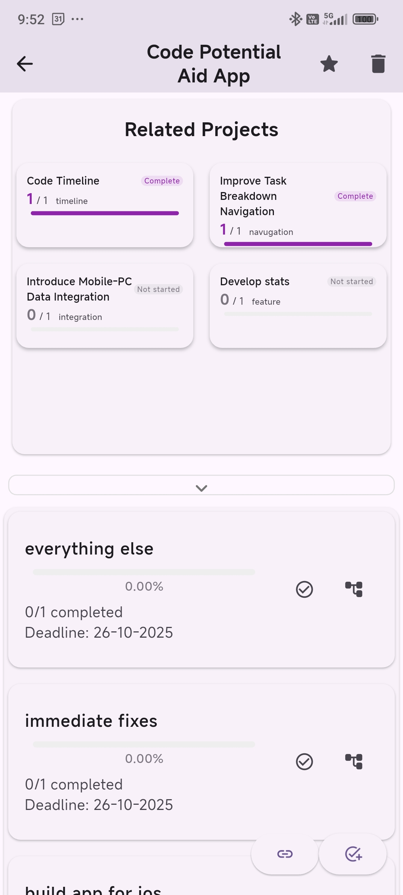
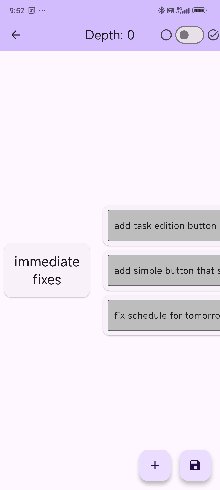
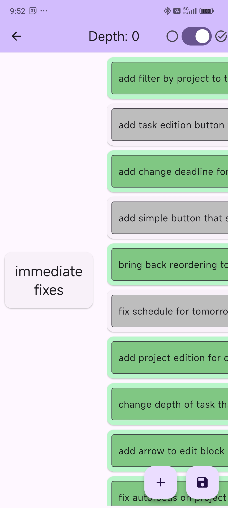
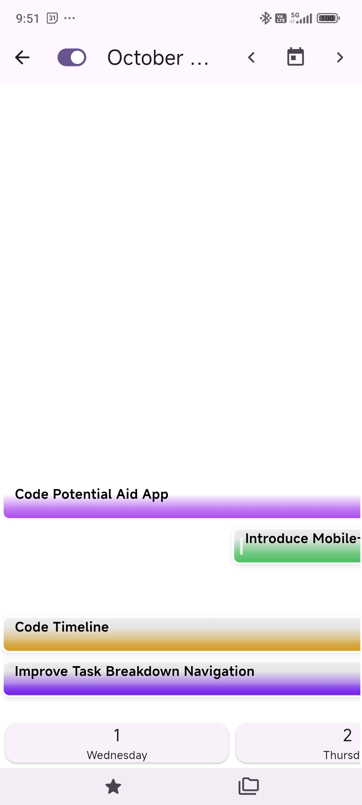
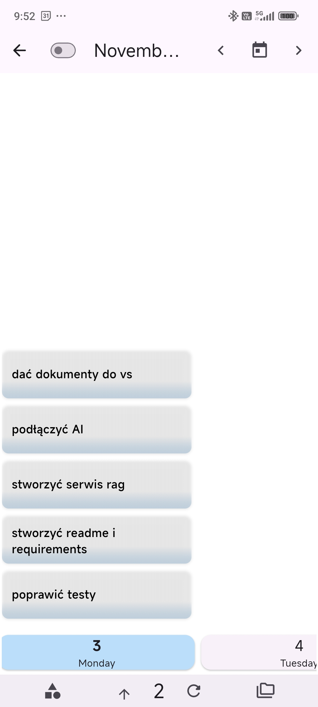
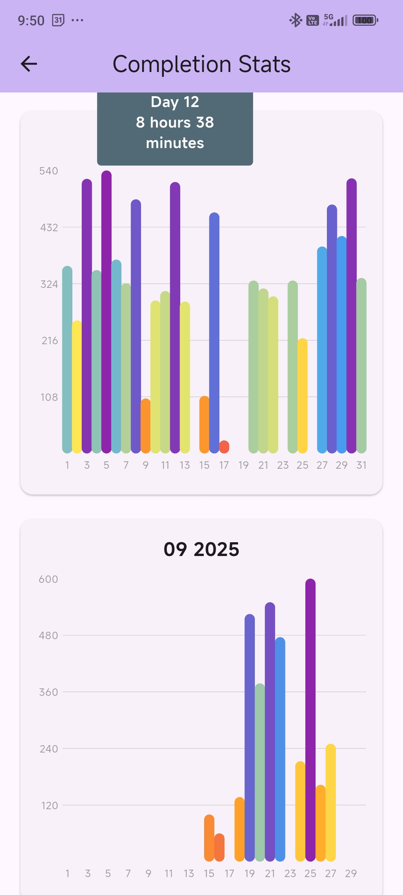

# Habit Timer App

## Overview

This a project management and scheduling Flutter app. It allows for project planning, frictionless task breakdown, timeline tracking, measures your performance and displays stats.

## Features

- Manage schedule, projects, tasks, and subtasks
- Categorize Projects
- View Projects And Tasks On Timeline
- Breakdown Tasks Into Subtasks
- View Statistics and Performance Metrics
- Drift Database for data persistence

## Screenshots

<table>
  <tr>
    <td align="center">
      
      <br>
      Schedule
    </td>
    <td align="center">
      
      <br>
      Projects
    </td>
    <td align="center">
      
      <br>
      Categories
    </td>
    <td align="center">
      
      <br>
      Project
    </td>
  </tr>
  <tr>
    <td align="center">
      
      <br>
      Project 
    </td>
    <td align="center">
      
      <br>
      Task Breakdown
    </td>
    <td align="center">
      
      <br>
      Task Breakdown 2
    </td>
    <td align="center">
      
      <br>
      Timeline Projects
    </td>
  </tr>
  <tr>
    <td align="center">
      
      <br>
      Timeline Tasks
    </td>
    <td align="center">
      
      <br>
      Stats
    </td>
  </tr>
</table>

## Getting Started

To run the app locally, follow these steps:

1. Clone the repository:

```bash
   git clone https://github.com/Orio77/potential_aid_app.git
```

2. Navigate to the project folder:

```bash
cd potential_aid_app
```

3. Install dependencies:

```bash
flutter pub get
```

4. Run the app:

```bash
flutter run
```

## Dependencies

- Flutter
- Dart
- Drift

```bash
Copy code
flutter run
```

## Dependencies

- Flutter
- Dart
- Drift

## License

© 2025 Maciej Lisak. All rights reserved.
